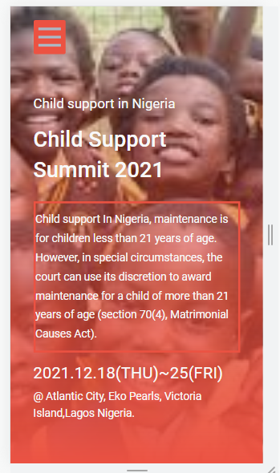

# Child-Support-Summit
# First Capstone-Project 

## Description
> My first Microverse capstone project which is a Child-Support-Summit website.

## Built With

- html
- css
- javascript

## Procedure to clone project
- open your terminal
- type git clone https://github.com/oluwajuwon8/Child-Support-Summit
- run the project in your local machine
- Run the project in you browser 
- Inspect it to check the look in mobile format.

## project link
click on the website and demo below to view project

- link to website: [website link]( https://oluwajuwon8.github.io/Child-Support-Summit/)

- link to loom to see video presesentation: [video link]()

## Project screenshot

Desktop view header                      |  Mobile view header
:---------------------------------------:|:---------------------------------------:
           |  

## Author

👤 **showole azeezat**

- GitHub: [@githubhandle](https://github.com/oluwajuwon8)
- Twitter: [@twitterhandle](https://twitter.com/oluwafu87040629)
- LinkedIn: [LinkedIn](https://linkedin.com/in/showole-azeezat-omolola-4368a7ba/)

## Acknowledgement

**cindy shin**
creator of original design template

## 🤝 Contributing

Contributions, issues, and feature requests are welcome!

Feel free to check the [issues page](../../issues/).

## Show your support

Give a ⭐️ if you like this project!

## 📝 License

This project is [MIT](./MIT.md) licensed.

